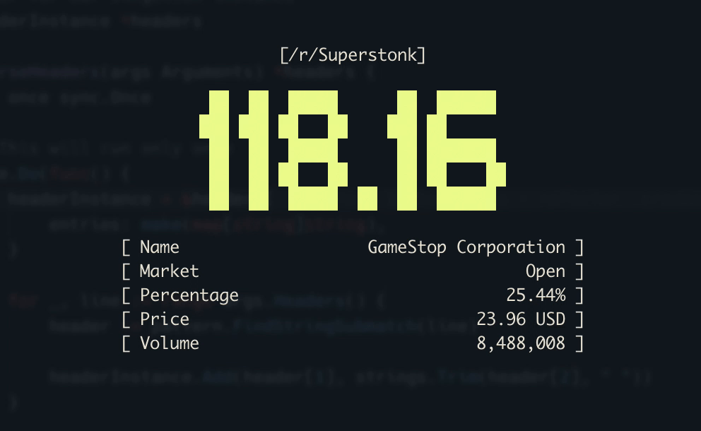

# /r/superstonk

The superstonk terminal is merely a pretty visualization of a stock. To be used for pretty graphical terminal output.
This project is created due to learning golang, and the code base will change over time.


## Usage

Install the binary from <https://github.com/bjarneo/superstonk/releases>, or go directly to the build the binary manually step.

```bash
$ superstonk -interval 10 -shares 10
```

### The default values

```
Usage of superstonk
  -interval int
    	The refresh interval in seconds (default: 5)
  -shares float
    	The quantity of stocks you own (default: 0)
  -symbol string
    	The stock symbol to watch (default: gme)

```

## Get it up and running [DEV]

```bash
# By using the go binary directly
go run main.go

# By using air you get hot reloading
air
```

Air: [<https://github.com/cosmtrek/air>](https://github.com/cosmtrek/air)

## Build the binary manually

```bash
$ go build

# will be available as superstonk
```

## Need a fully fledged awesome terminal?

GamestonkTerminal is the way <https://github.com/GamestonkTerminal/GamestonkTerminal>
